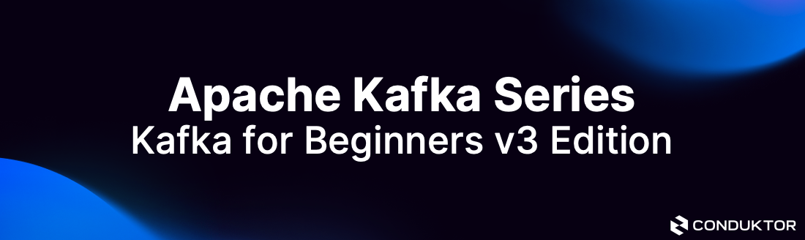

# Kafka for Beginners

This is a companion repository for the [Kafka for Beginners course](https://links.datacumulus.com/apache-kafka-coupon) by Conduktor

## Content
- Basics of Kafka Java Programming
- Wikimedia Producer
- OpenSearch Consumer
- Kafka Streams Sample Application

# By Conduktor

[Conduktor](https://www.conduktor.io) is about making Kafka accessible to everyone. Check out our free Kafka learning website [Kafkademy](https://kafkademy.com/) and our Apache Kafka Desktop Client [Conduktor DevTools](https://conduktor.io/download)

